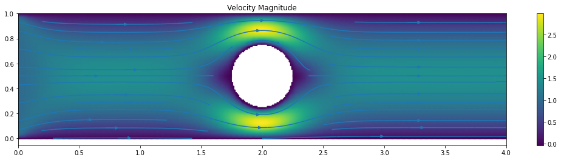

# Final project for CS555 - Numerical Methods for PDEs

This project contains codes to solve the steady-state [Stokes flow](https://en.wikipedia.org/wiki/Stokes_flow) problem in two dimensions using a finite element discretization in space.  The discretization emits a saddle-point problem which is iteratively solved for using a modified version of the conjugate-gradients method known as [Uzawa iteration](https://en.wikipedia.org/wiki/Uzawa_iteration).

For our domain, we take an elongated rectangle with a cylinder cut out in the middle.  The fluid is expected to flow around this obstacle.

Note the finite element assembly code is woefully unoptimized and may benefit greatly from careful vectorisation (by converting all operation to matrix-matrix/matrix-vector products, for example).  Still, I hope someone finds it useful or interesting to look at.
